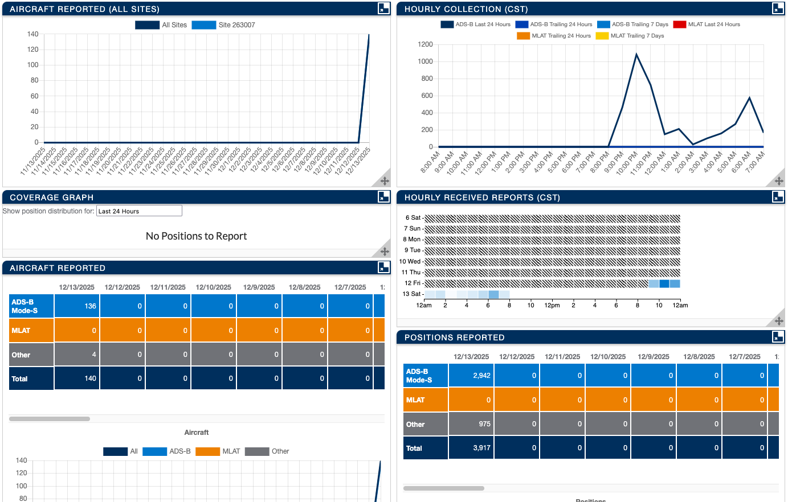

# MSP Aircraft Tracking Receiver

Working ADS-B receiver tracking aircraft over central and south Minnesota and western Wisconsin.

*Live aircraft tracking via web interface*

## Project Status: Operational

This receiver is actively tracking aircraft and sharing data with the FlightAware network. The system runs 24/7, capturing position, altitude, speed, and identification data from aircraft broadcasting on 1090 MHz.

*Data history interface*

## Current Setup

**Location:** Highland Park, St. Paul, MN (3 miles from MSP airport)

**Hardware:**
- Raspberry Pi Zero 2 W
- RTL-SDR Blog V3 dongle
- 1090 MHz ADS-B antenna
- 8GB microSD card
- Indoor placement, upper floor, north-facing window

**Software:**
- PiAware 10.0 (FlightAware's receiver software)
- dump1090-fa (ADS-B decoder)
- SkyAware web interface
- Automatic FlightAware data sharing

**Access:**
- Web interface: `http://piaware.local:8080`
- Data streams: ports 30005 (Beast) and 30003 (SBS-1)

## Reception Range

**Observed Coverage (Indoor Setup):**
- North: ~25 miles (Ramsey)
- South: ~15 miles (Rosemount)
- East: ~35 miles (River Falls, WI)
- West: ~45 miles (Waconia)

**Performance Notes:**
- Best reception to south and east (aircraft on MSP approach paths)
- Typically tracking 3-6 aircraft simultaneously during daytime
- Indoor placement provides adequate coverage for local traffic monitoring
- Range limited by building structure compared to outdoor mounting
- Upper floor location beneficial for line-of-sight reception

## What It Tracks

**Aircraft Information Received:**
- Real-time position (latitude/longitude)
- Altitude (barometric and GPS)
- Ground speed and heading
- Vertical speed (climb/descent rate)
- Flight number/callsign
- Aircraft registration
- Aircraft type and model
- Squawk code (transponder code)

**Typical Traffic:**
- Commercial flights arriving/departing MSP
- Regional jets and turboprops
- Private general aviation aircraft
- Cargo flights
- Occasional military aircraft

## Technical Details

**Reception:**
- Frequency: 1090 MHz (ADS-B)
- Modulation: PPM (Pulse Position Modulation)
- Protocol: Mode S Extended Squitter
- Update rate: ~1 second per aircraft

**Data Output:**
- Beast format (raw binary): port 30005
- SBS-1 BaseStation format (text): port 30003
- Web interface: port 8080
- FlightAware feed: automatic background upload

**System Performance:**
- CPU usage: ~9% (Raspberry Pi Zero 2 W)
- Memory usage: Minimal (~200MB)
- Power consumption: ~2.5W
- Network bandwidth: ~1-2 Mbps sustained
- Uptime: Continuous (restarts only for updates)

## Data Sharing

**FlightAware Integration:**
- Receiver automatically shares data with FlightAware network
- Contributes to global aircraft tracking coverage
- Provides multilateration (MLAT) support when synchronized
- Free Enterprise account benefits for data contributors

**Access to Data:**
- FlightAware statistics: https://www.flightaware.com/adsb/stats
- Live coverage map shows areas this receiver monitors
- Historical statistics track uptime and aircraft detected

## Viewing Options

**Built-in Web Interface (SkyAware):**
- Interactive map with real-time aircraft positions
- Aircraft list with detailed information
- Signal strength graphs
- Range/altitude plots
- MLAT status indicators

**Compatible Applications:**
- Any ADS-B viewer supporting Beast or SBS-1 formats
- Custom applications via data stream ports
- FlightAware website for worldwide coverage view

**Attempted Integrations:**
- RealADSB Apple TV app: Connection issues (under investigation)
- Web browser access: Working perfectly on all devices

## Project Cost

**Hardware Investment:**
- Raspberry Pi Zero 2 W: $15
- RTL-SDR Blog V3: $30
- ADS-B antenna: $25
- MicroSD card (8GB): $8
- Power supply: $8
- Micro-USB OTG adapter: $6

**Total: ~$92**

**Ongoing Costs:** None (electricity negligible at ~2.5W)

## Advantages of This Setup

**Indoor Reception:**
- No outdoor antenna installation required
- No weatherproofing concerns
- Easy to relocate or adjust
- Protected from weather damage
- Sufficient for local traffic monitoring

**Proximity to MSP Airport:**
- Strong signals from low-altitude traffic
- Clear view of approach and departure paths
- High volume of commercial traffic
- Interesting variety of aircraft types

**Self-Contained System:**
- Runs independently (no computer required)
- Web interface accessible from any device on network
- Automatic updates via FlightAware
- Low maintenance requirements

## Limitations

**Indoor Placement:**
- Reduced range compared to outdoor rooftop mounting
- Building structure attenuates signals
- Some blind spots due to obstructions
- North-facing window not optimal for southern traffic

**Hardware Constraints:**
- Single frequency (1090 MHz only)
- Cannot receive UAT 978 MHz (US general aviation)
- Pi Zero 2 W has limited processing power for advanced features
- No built-in GPS (MLAT requires network sync)

**Coverage Gaps:**
- Limited reception of distant high-altitude traffic
- Terrain blocking in some directions
- Metal/concrete building interference
- Cannot track aircraft with transponders off

## Future Enhancements

**Potential Improvements:**
- Outdoor antenna mounting for extended range
- LNA (Low Noise Amplifier) for better sensitivity
- Bandpass filter to reduce interference
- Second receiver for 978 MHz UAT reception
- Custom web interface with additional features
- Integration with weather satellite receiver project

**Not Planned:**
- Commercial grade equipment (unnecessary for hobbyist use)
- Multiple antenna array (diminishing returns)
- Professional installation (DIY approach working well)

## Build Documentation

**For detailed build instructions, see:**
- [setup.md](setup.md) - Complete setup log with troubleshooting
- Hardware assembly process
- SD card flashing steps (Balena Etcher recommended)
- WiFi configuration procedure
- First boot sequence
- Apple TV app connection attempts

**Key Lessons Learned:**
- Balena Etcher more reliable than Raspberry Pi Imager for macOS
- Indoor placement viable for local traffic monitoring
- FlightAware PiAware software works out-of-box
- Proximity to major airport provides excellent coverage despite indoor setup
- Web interface sufficient for monitoring (dedicated apps optional)

## Related Projects

**Weather Satellite Reception:**
- Separate receiver planned for NOAA and Meteor-M satellites
- Will use different antenna (137 MHz vs 1090 MHz)
- Complementary project using similar RTL-SDR technology
- See: [weather-satellite-reception](https://github.com/dgbenner/weather-satellite-reception)

**Hybrid Flight Tracker:**
- Custom web application combining local receiver data
- Integration with Airplanes.live API for global coverage
- Future development project
- See: [minneapolis-flight-tracker](https://github.com/dgbenner/minneapolis-flight-tracker)

## Resources Used

**Software:**
- PiAware: https://flightaware.com/adsb/piaware/
- Balena Etcher: https://etcher.balena.io/
- Raspberry Pi OS (embedded in PiAware image)

**Hardware:**
- RTL-SDR Blog: https://www.rtl-sdr.com/
- Raspberry Pi Foundation: https://www.raspberrypi.com/

**Community:**
- FlightAware Forums: https://discussions.flightaware.com/
- Reddit r/RTLSDR: https://reddit.com/r/RTLSDR
- RTL-SDR Blog tutorials and guides

## Troubleshooting Reference

**Common Issues Encountered:**
- macOS mounting errors with PiAware SD card image (expected behavior)
- Apple TV app connection problems (ongoing investigation)
- Network discovery using hostname vs IP address

**Solutions Applied:**
- Used Balena Etcher instead of Raspberry Pi Imager
- Accessed web interface via browser instead of dedicated app
- Used `ping piaware.local` to discover IP addresses

**System Monitoring:**
- Check status: `http://piaware.local/`
- View logs: SSH access or FlightAware stats page
- Verify operation: Aircraft should appear within 5-10 minutes

## License

This project documentation is provided as-is for educational purposes. Hardware and software mentioned are trademarks of their respective owners.

---

*Project completed: December 12, 2025*  
*Last updated: December 13, 2025*
